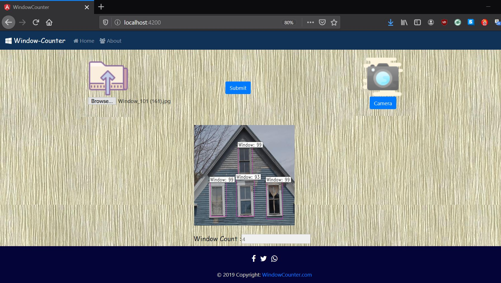

### Window_Counter
Window Counter is a web application to automate the stocktaking of building windows. This application detects a window image in a highlighted rectangular box by assigning its tag and accuracy.

### Installation
### Clone
Clone this repo to your local machine using https://github.com/OVGU-Fraunhofer/Window_Counter
### Setup
* Naviagate to Frontend directory in the local machine
* Run npm install
* Run ng serve
* Naviagate to backend directory
* Run python backend.py
* Browse for http://localhost:4200/
### Collaborators
* Kamalhasan Battu, github: [Kamalhsn](https://github.com/Kamalhsn)
* Narendra Kumar Anupoju, github: [narendraanupoju](https://github.com/narendraanupoju) 
* Nikhilesh Sandela, github:
* Praveen Putti, github:
* Thirupathi Rao Pendyala, github: [tirupendyala](https://github.com/tirupendyala)
* Vinayak Kudurmuthy, github: [vinayak09](https://github.com/vinayak09)
### Support
### License
* [MIT License](https://github.com/OVGU-Fraunhofer/Window_Counter/blob/master/LICENSE)
* Copyright (c) 2020 [OVGU-Fraunhofer](https://github.com/OVGU-Fraunhofer/Window_Counter)
